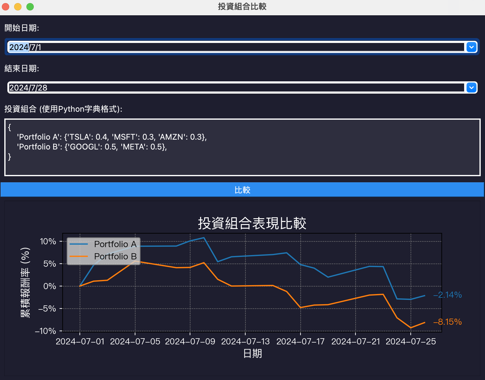

# StockPortfolioAnalyzer

## 簡介
此項目旨在利用 PyQt5 和網絡爬蟲技術比較不同股票投資組合的報酬率。

## 數據爬取來源
* [yfinance](https://pypi.org/project/yfinance/)

## 環境搭建

* 安裝套件
```
pip install pandas numpy yfinance matplotlib PyQt5
```

## 使用方法

* 下載此 Git 存放庫
```
git clone https://github.com/paulkuo123/StockPortfolioAnalyzer.git
```
* 切換至 StockPortfolioAnalyzer 資料夾
```
cd StockPortfolioAnalyzer
```
* 執行 main.py
```
python main.py
```

## Demo


